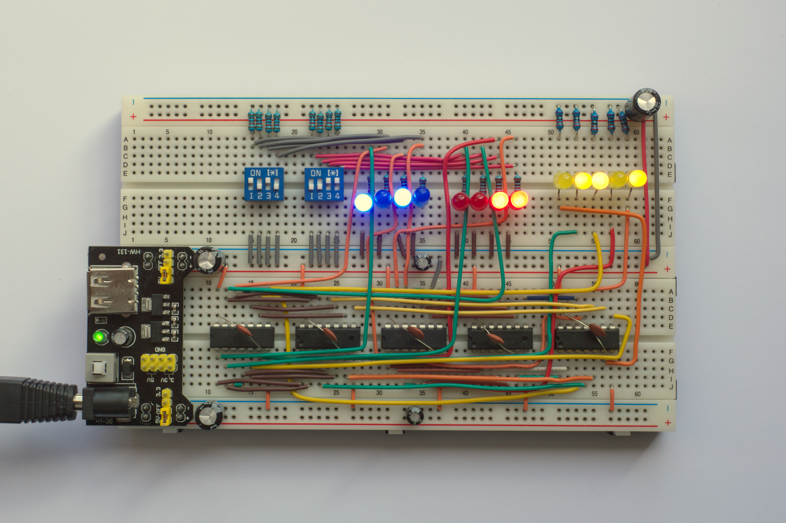
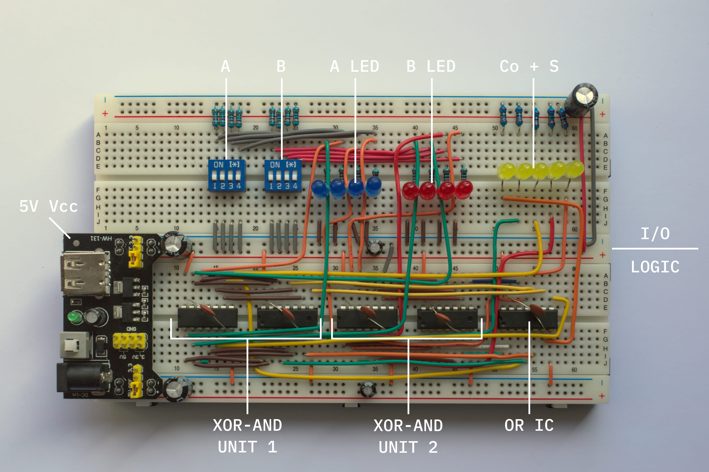
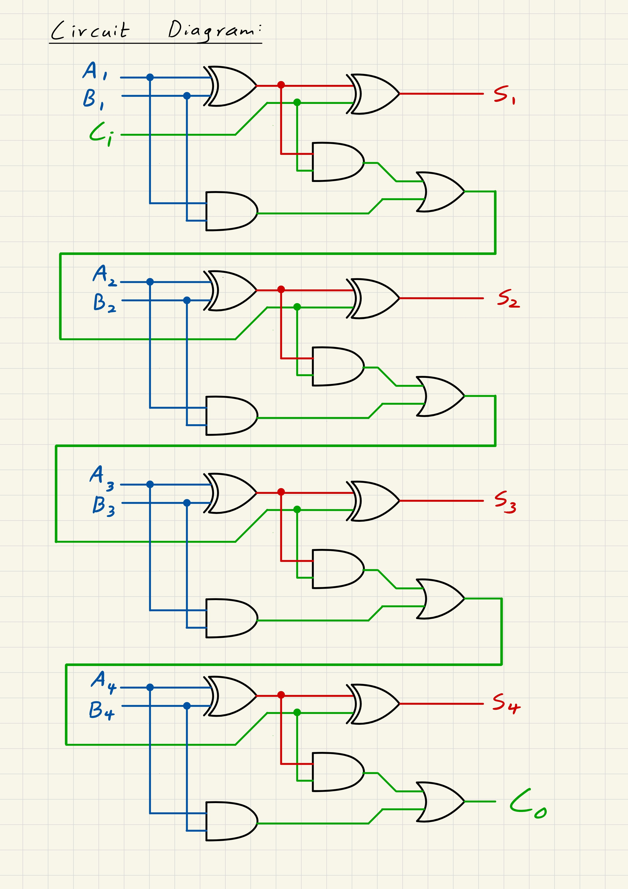

# 4-Bit Breadboard Full Adder
A 4-bit full adder built from discrete logic gate ICs, spread across two breadboards. Inputs are set with DIP switches, the output is displayed using LEDs.

## How it works

Each bit is calculated with a full adder built from individual gates, by using two half adders(XOR + AND) plus an OR gate to combine the carry-bits. The circuit for each bit is modular and can be chained together, such that the carry-out of one bit feeds carry-in of the next, for any number of bits. In this implementation, four of them are chained together to form a 4-bit full adder circuit.

Due to the design, the calculations are run continuously and in real-time, hence not requiring a "enter" or "execute" button to run them.

- **Inputs:** 2 DIP switch banks(4 positions each) to set the two 4-bit binary numbers, A and B. The inputs are also displayed using LEDs.
- **Outputs:** 4 LEDs show the sum bits and 1 additional LED shows the final carry bit.

### Truth Table (1-bit):

| Cin | A | B | Co | S |
|-----|---|---|----|---|
| 0   | 0 | 0 | 0  | 0 |
| 0   | 0 | 1 | 0  | 1 |
| 0   | 1 | 0 | 0  | 1 |
| 0   | 1 | 1 | 1  | 0 |
| 1   | 0 | 0 | 0  | 1 |
| 1   | 0 | 1 | 1  | 0 |
| 1   | 1 | 0 | 1  | 0 |
| 1   | 1 | 1 | 1  | 1 |

## Details of the Build

### Component Choices: 
The 74HCXX series of ICs was selected due to their CMOS technology, negligible idle power consumption, as well as clean output voltages (0V & 5V). Due to each chip being equipped with quad gates, each pair of XOR & AND ICs is processing 2-bits of input and output in this layout. 74HCXX chips are also capable of providing enough current to power 2 LEDs per chip.  

### Layout: 
A total of 20 gates across 5 ICs, along with 8 switches and 13 LEDs, needed more space than what a single breadboard can provide. Hence the circuit was split across two boards, the top one being the I/O unit and the bottom one being the logic unit and power supply. This layout keeps the wiring paths between ICs short, and allows them to have access to their own stabilised power rails.

### Stabilisation:
Floating inputs and power spikes caused by simultaneous gate activations were solved with the following measures:
- Firstly, 10k pull down resistors were used on all inputs to pull the inputs of the gates down to 0 by default. This also forced changes to the wiring of the input LEDs, having to now wire them in parallel instead of series to the pull down resistors.

- Secondly, the voltage supply was stabilised against sudden power surges or drops by using multiple capacitors.
  - **100 µF** electrolytic capacitors for general power rail stabilisation at the start of the rails, next to the power supply
  - **10 µF** electrolytic capacitors in the middle of the rails used by the ICs to provide additional stability when multiple ICs activate simultaneously
  - **0.1 µF** ceramic capacitors wired right across Vcc and GND of the ICs to neutralise high-frequency noise (as recommended by the manufacturer)

## Component List

- 74HC32 OR IC x1 
- 74HC08 AND IC x2 
- 74HC86 XOR IC x2
- DIP switches ×2 (4-position)
- LEDs: 4 + 4 + 5 (Input A, Input B, Output + Carry-bit)
- Resistors: 220 Ohm x13
- Pull-down resistors: 10k Ohm x8
- Capacitors:
  - 0.1 µF ceramic ×5
  - 10 µF electrolytic ×2
  - 100 µF electrolytic ×3
- 5V MB102 power supply module
- Breadboards ×2

## Verification Table:
| A       | B       | Expected Carry + Sum |   Measured    |
|---------|---------|----------------------|---------------|
| 0000    | 0000    | 00000                | 00000         |
| 0001    | 0001    | 00010                | 00010         |
| 0101    | 0011    | 01000                | 01000         |
| 1111    | 0001    | 10000                | 10000         |
| 1111    | 1111    | 11110                | 11110         |

## Circuit Diagram:

